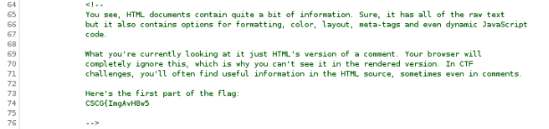
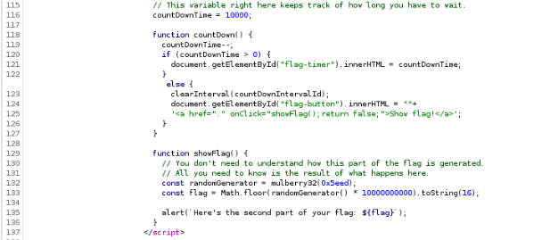
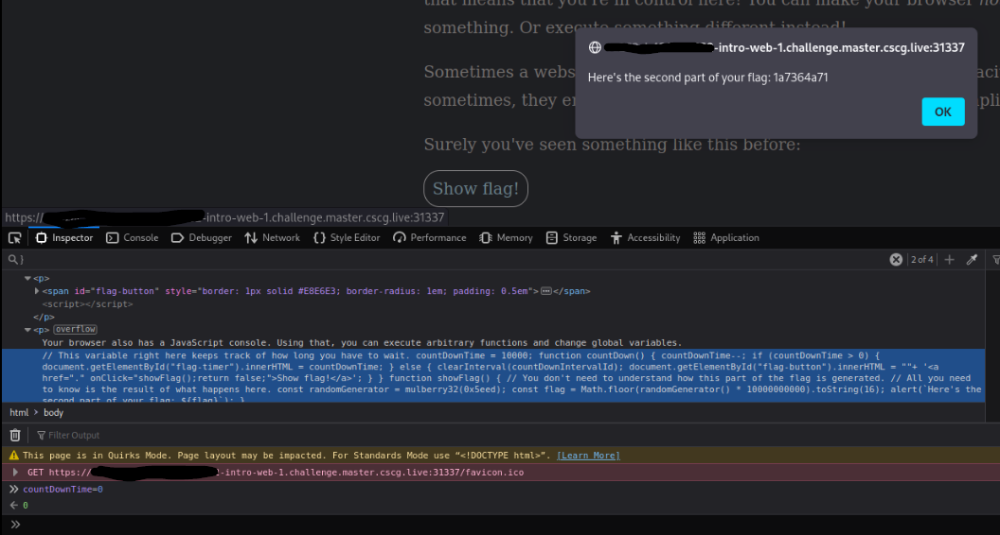
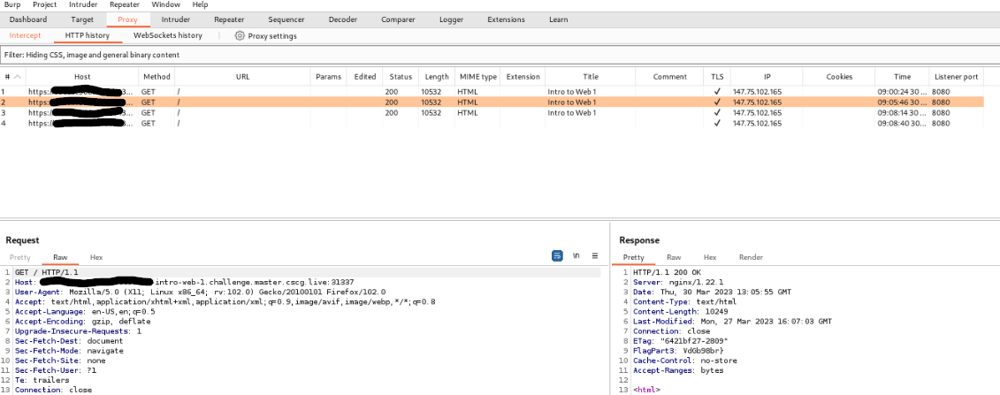

# Intro to Web 1

## Flag Part 1/3 - Source Code

View page source code and you'll find the first part of the flag in a comment:

## Flag Part 2/3 - Variable Manipulation

Also viewing the page source code there are two interesting variables, named "countDown" and "showFlag". 

It seems after the countdown is down to zero the flag will be shown. So I opened up the Browser Console and set the variable "countDownTime" to 0, which gives us the second part of the flag:

## Flag Part 3/3 - Response Header

Firing up BurpSuite to intercept the traffic shows us the third part of the flag in response Header:

