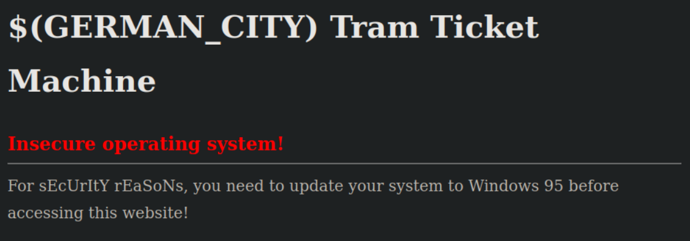
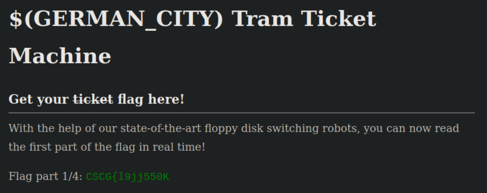
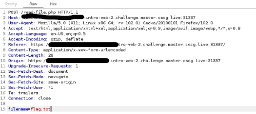
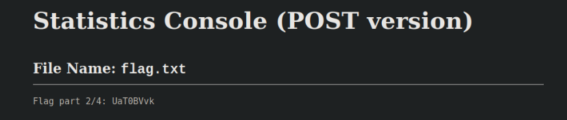
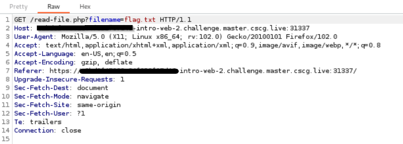
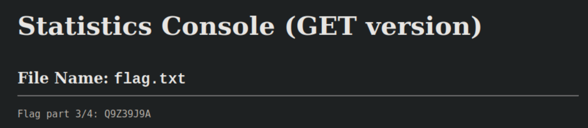
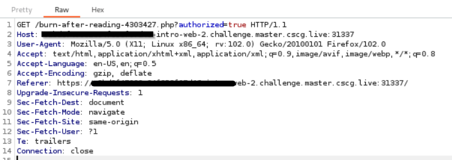
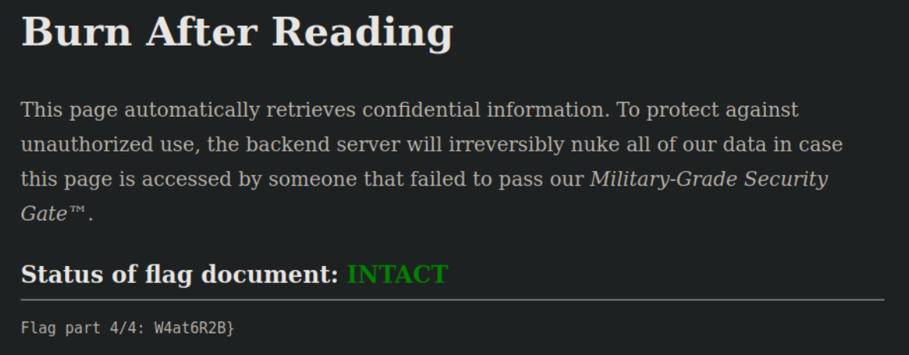

# Intro to Web 2

## Flag Part 1/4 - User Agent 

Visiting the hyperlink gives us a hint that we need Windows 95 to access the website:

So I've changed the User Agent to 'Mozilla/2.0 (compatible; MSIE 3.0; Windows 95) and resend the request:

Changing the User Agent gives us the first part of the flag:

## Flag Part 2/4 - POST Method File Inclusion

Viewing the source code of the page there is a hint that a file 'flag.txt' exists. So I've manipulated the POST request to access the file 'flag.txt':

This gives us the second part of the flag:

## Flag Part 3/4 - GET Method File Inclusion

Same procedure as in Part 2 but now with GET method:

Third Part of the flag:

## Flag Part 4/4 - Parameter Manipulation

Intercepting the hyperlink with Burp shows a parameter 'authorized' with the value 'false'. Changing the value to true, gives us access to the flag:

