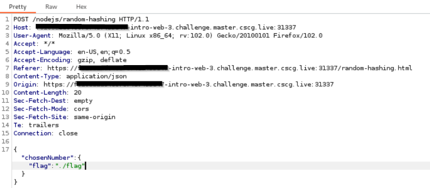
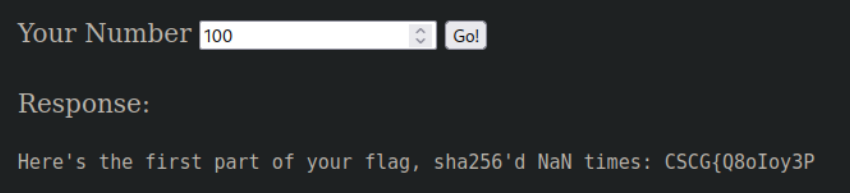

# Intro to Web 3

## Flag Part 1/4 - JSON & Missing Input Validation

Viewing the JavaScript source code shows that we may can access the flag before it gets hashed. When intercepting a request we see that request is sent in JSON format. The webserver seems not be accepting strings, so I've tried an array - with success:

Which gives us the flag:

## Flag Part 2/4 - SQL Injection
